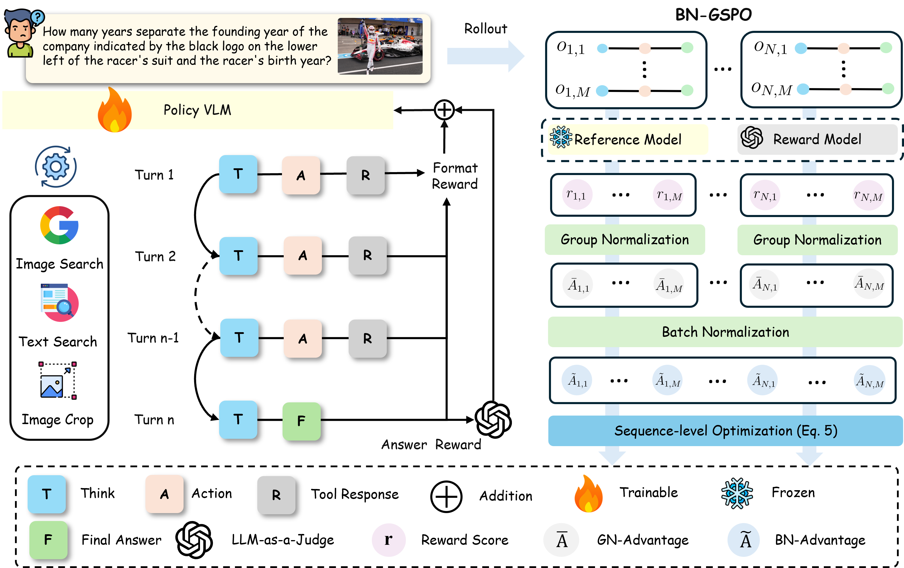
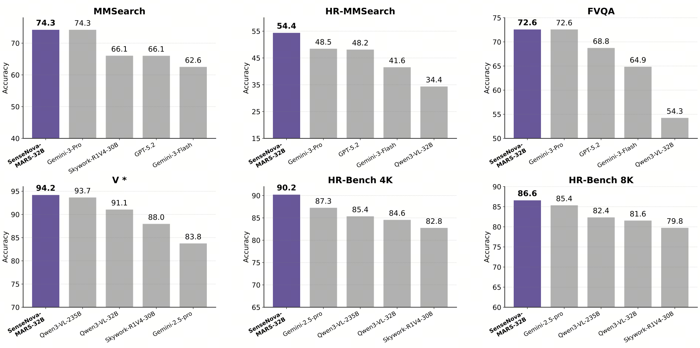
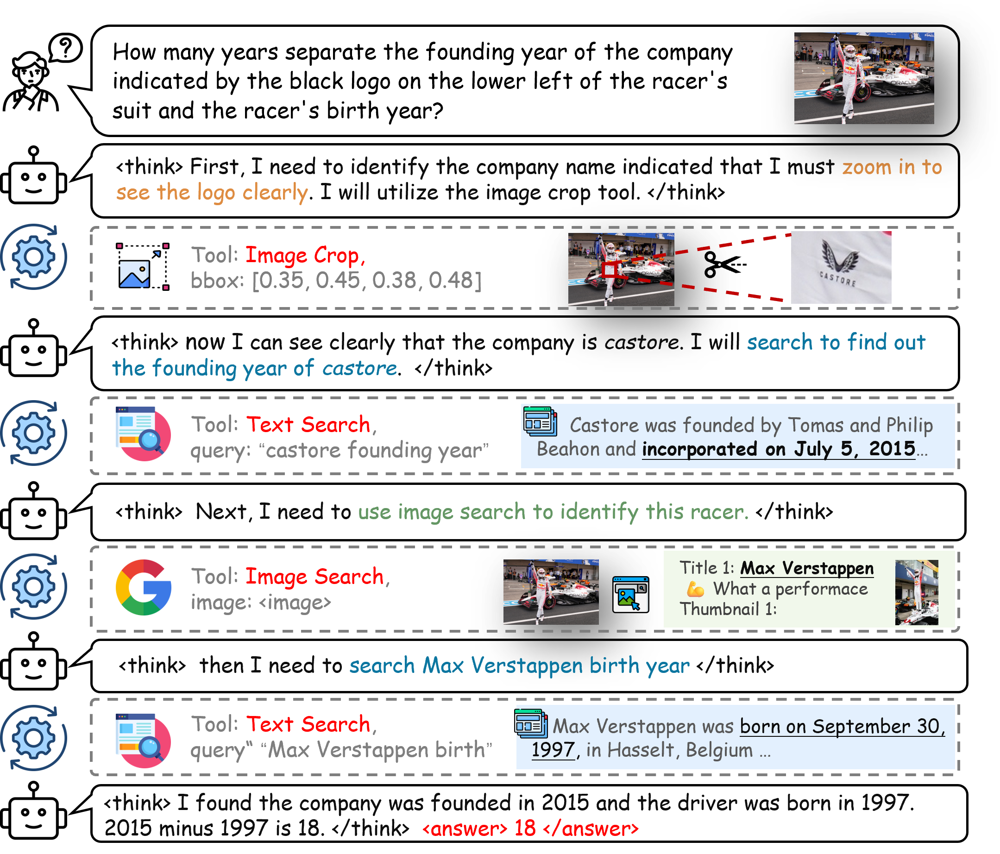
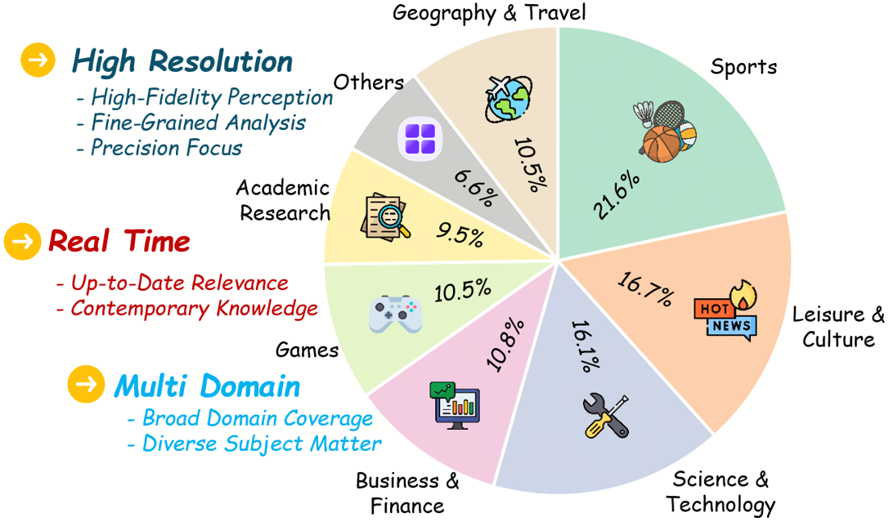

<div align="center">

# 🪐 SenseNova-MARS: Empowering Multimodal Agentic Reasoning and Search via Reinforcement Learning

</div>

<div align="center">
  <a href="http://arxiv.org/abs/2512.24330">
    
  </a>
    <a href="https://huggingface.co/datasets/sensenova/SenseNova-MARS-Data">
    
  </a>
    <a href="https://huggingface.co/datasets/sensenova/HR-MMSearch">
    
  </a>
    </a>
  <a href="https://huggingface.co/sensenova/SenseNova-MARS-8B">
    
  </a>
  <a href="https://huggingface.co/sensenova/SenseNova-MARS-32B">
    
  </a>
</div>

## News
* 2026.02.23: We are excited to announce that our paper has been accepted to CVPR 2026! 🎉
* 2026.02.05: We release a [prebuilt Docker image](https://hub.docker.com/r/yxchng/sensenova-mars) and a lightweight [standalone inference code](inference/README.md) (without web_search_server and verl dependencies).
* 2026.01.29: We release the model [SenseNova-MARS-8B](https://huggingface.co/sensenova/SenseNova-MARS-8B) and [SenseNova-MARS-32B](https://huggingface.co/sensenova/SenseNova-MARS-32B).
* 2026.01.01: We release the training and inference code.
* 2026.01.01: We release the [Paper](http://arxiv.org/abs/2512.24330), [SenseNova-MARS-Data](https://huggingface.co/datasets/sensenova/SenseNova-MARS-Data) and [HR-MMSearch Benchmark](https://huggingface.co/datasets/sensenova/HR-MMSearch).

## Contents
- [Introduction](#overview)
- [Release Information](#release-information)
- [Quick Start](#quick-start)
- [Benchmark Performance](#benchmark-performance)
- [Acknowledgements](#acknowledgements)
- [Citation](#citation)

## Overview

While Vision-Language Models (VLMs) can solve complex tasks through agentic reasoning, their capabilities remain largely constrained to text-oriented chain-of-thought or isolated tool invocation. They fail
to exhibit the human-like proficiency required to seamlessly interleave dynamic tool manipulation with
continuous reasoning, particularly in knowledge-intensive and visually complex scenarios that demand
coordinated external tools such as search and image cropping. In this work, we introduce SenseNova-MARS,
a novel Multimodal Agentic Reasoning and Search framework that empowers VLMs with interleaved
visual reasoning and tool-use capabilities via reinforcement learning (RL). Specifically, SenseNova-MARS
dynamically integrates the image search, text search, and image crop tools to tackle fine-grained and
knowledge-intensive visual understanding challenges. In the RL stage, we propose the Batch-Normalized
Group Sequence Policy Optimization (BN-GSPO) algorithm to improve the training stability and advance
the model’s ability to invoke tools and reason effectively. To comprehensively evaluate the agentic VLMs
on complex visual tasks, we introduce the HR-MMSearch benchmark, the first search-oriented benchmark
composed of high-resolution images with knowledge-intensive and search-driven questions. Experiments
demonstrate that SenseNova-MARS achieves state-of-the-art performance on open-source search and
fine-grained image understanding benchmarks. Specifically, on search-oriented benchmarks, SenseNovaMARS-32B scores 74.3 on MMSearch and 54.4 on HR-MMSearch, surpassing proprietary models such
as Gemini-3-Pro and GPT-5.2. SenseNova-MARS represents a promising step toward agentic VLMs by
providing effective and robust tool-use capabilities.
<p align="center">
    
<p>


Overall performance of SenseNova-MARS-32B compares to other models across six benchmarks. SenseNova-MARS-32B can surpass proprietary models such as Gemini-3-Pro and GPT-5.2 on the search-oriented benchmarks such as MMSearch and HR-MMSearch
<p align="center">
    
<p>

SenseNova-MARS can tackle the challenging visual task by leveraging an integrated suite of text search, image search, and image crop tools within the reasoning process. This is a demo example.
<p align="center">
    
<p>

## Release Information
### Models

| Model | HuggingFace |
|----------|----------|
| SenseNova-MARS-8B | [🤗 link](https://huggingface.co/sensenova/SenseNova-MARS-8B)| 
| SenseNova-MARS-32B | [🤗 link](https://huggingface.co/sensenova/SenseNova-MARS-32B)| 


### Datasets
| Datasets | HuggingFace | Google Drive |
|----------|----------|----------|
| SenseNova-MARS-Data | [🤗 link](https://huggingface.co/datasets/sensenova/SenseNova-MARS-Data) | [ 📁 link](https://drive.google.com/drive/folders/1ClHduHWMaARbraNaaCnSE3DTKgJDDIiM?usp=sharing) |

<!-- TODO: Update HuggingFace model link -->

### HR-MMSearch Benchmark

HR-MMSearch Benchmark is the first search-oriented benchmark composed of high-resolution images with knowledge-intensive and search-driven questions.

| Benchmark | HuggingFace |
|----------|----------|
| HR-MMSearch | [🤗 link](https://huggingface.co/datasets/sensenova/HR-MMSearch) |

<!-- TODO: Update HuggingFace HR-MMSearch dataset link -->

<p align="center">
    
<p>

---
## Quick Start
### Hardware Requirements

Our RL training setup for SenseNova-MARS requires **3 separate nodes** with **8x NVIDIA H100 GPUs (80GB)** each:

| Node | Purpose | Services |
|------|---------|----------|
| Node 1 | Training | RL training with veRL framework |
| Node 2 | Infrastructure | Web Search Server (port 8000) + Local Wikipedia Database Server (port 8001) + Summarizer LLM (port 8123) |
| Node 3 | LLM Judge | Qwen3-VL-32B-Instruct judge server (port 8181) |

**Evaluation only:** If you only want to run evaluation (not training), you need 2 nodes:
- Node 1 for running the evaluation script
- Node 2 for infrastructure services (Web Search, Local Database, Summarizer)

---

### Installation

#### Step 1: Download Data

Download the required data from Google Drive:

**[Download Link](https://drive.google.com/drive/folders/1ClHduHWMaARbraNaaCnSE3DTKgJDDIiM?usp=sharing)**

After downloading, extract and place the directories so your project structure looks like:

```
SenseNova-MARS/
├── wiki_20250901/              # Local Wikipedia database (download required)
├── Search-R1/                  # Local retrieval server (download required)
├── data/
│   ├── eval/                   # Evaluation datasets (download required)
│   └── train_qwen3_vl_8b/      # Training data (download required)
├── verl/                       # Modified veRL framework
├── web_search_server/          # Web search server
├── config/                     # Tool configurations
├── assets/                     # Images for documentation
├── Dockerfile
├── train_multi_node.sh
├── eval_single_node.sh
├── train_qwen3_vl_8b.json      # Training data manifest
├── test_subset.json            # Validation subset
├── test_all.json               # Complete test set
└── README.md
```

#### Step 2: Build and Run Docker Environment

**Option A: Use prebuilt Docker image (Recommended)**

```bash
docker pull yxchng/sensenova-mars:v0.1

docker run -it --gpus all --shm-size=64g \
    -v /path/to/SenseNova-MARS:/workspace/SenseNova-MARS \
    -p 8000:8000 -p 8001:8001 -p 8123:8123 -p 8181:8181 -p 8265:8265 \
    yxchng/sensenova-mars:v0.1

# Inside container, navigate to the project directory
cd /workspace/SenseNova-MARS
```

**Option B: Build from source**

```bash
docker build -t verl-mars:latest .

# If in China, use mirrors for faster download:
docker build --build-arg USE_MIRROR=true -t verl-mars:latest .

docker run -it --gpus all --shm-size=64g \
    -v /path/to/SenseNova-MARS:/workspace/SenseNova-MARS \
    -p 8000:8000 -p 8001:8001 -p 8123:8123 -p 8181:8181 -p 8265:8265 \
    verl-mars:latest

# Inside container, navigate to the project directory
cd /workspace/SenseNova-MARS
```

---

### Infrastructure Setup

Before training or evaluation, you need to launch the following services:

#### 1. Web Search Server (Text Search)

The web search server provides text search capabilities. It supports two modes:
- **Training**: Uses local Wikipedia database (`local_retrieval`)
- **Validation/Evaluation**: Uses Google Serper API (`google_serper`)

**Getting a Serper API Key:**
1. Go to [serper.dev](https://serper.dev) and create an account
2. Navigate to your dashboard to get your API key

**Note:** A free Serper account includes 2,500 queries. Training requires more than this, but you can test evaluation with the free tier first.

```bash
cd web_search_server

# Set environment variables
export WEBSEARCH_GOOGLE_SERPER_KEY="<YOUR_SERPER_API_KEY>"  # Get from https://serper.dev
export AZURE_OPENAI_API_KEY="<YOUR_AZURE_OPENAI_KEY>"
export WEB_SERVER_CONFIG_FILE="./config.json"
export WEB_SERVER_CACHE_DIR="./search_cache"
export SUMMARIZER_BASE_URL="http://localhost:8123/v1"

# Install dependencies (if not using Docker)
pip install -r requirements.txt
playwright install-deps
playwright install

# Start the server (default port 8000)
uvicorn server:app --host 0.0.0.0 --port 8000
```

#### 2. Local Wikipedia Database Server

The local database server provides fast local text retrieval using the Wikipedia dump (required for training).

##### Step 1: Set up Faiss Environment

```bash
# Create faiss conda environment
conda create -n faiss python=3.12 -y
conda activate faiss

# Install dependencies
conda install -c pytorch -c nvidia -c rapidsai -c conda-forge \
  libnvjitlink pytorch-cuda=12.4 pytorch transformers datasets \
  faiss-gpu-cuvs=1.12.0 numpy==1.26.4 uvicorn fastapi -y
```

##### Step 2: Launch Local Database Server

To set up the retrieval backend, we use the [Search-R1](https://github.com/PeterGriffinJin/Search-R1) framework. You will need to download the repository and launch the local retrieval server to handle incoming search queries.

**Clone the Repository:**
```bash
git clone https://github.com/PeterGriffinJin/Search-R1
cd Search-R1

```

**Run the Server:**
Execute the following command to start the FAISS-based retrieval service:

```bash
conda activate faiss

python -u Search-R1/search_r1/search/retrieval_server.py \
  --index_path wiki_20250901/e5_Flat.index \
  --corpus_path wiki_20250901/formatted_wiki.jsonl \
  --topk 3 \
  --retriever_name e5 \
  --retriever_model intfloat/e5-large-v2 \
  --faiss_gpu \
  --port 8001

```

#### 3. Summarizer LLM Server

The summarizer LLM processes and summarizes search results. Launch using SGLang on **8x H100 GPUs** (can run on the same node as the search servers):

```bash
python -m sglang.launch_server \
    --model-path Qwen/Qwen3-32B \
    --served-model-name Qwen/Qwen3-32B \
    --host 0.0.0.0 --port 8123 \
    --dtype bfloat16 \
    --tp-size 4 --dp-size 2 \
    --mem-fraction-static 0.9 \
    --max-total-tokens 262144 \
    --max-prefill-tokens 65536 \
    --chunked-prefill-size 16384 \
    --max-running-requests 1024
```

#### 4. LLM Judge Server (Required for RL Training)

The LLM judge evaluates model outputs during training:
- **Training**: Uses Qwen3-VL-32B-Instruct (self-hosted via SGLang)
- **Validation**: Uses GPT-4o via Azure OpenAI API

**Azure OpenAI Setup:**
The validation judge uses Azure OpenAI client by default. You need an `AZURE_OPENAI_API_KEY` for validation scoring. If you prefer to use the standard OpenAI API instead, modify `verl/verl/workers/reward_manager/tool.py` to use `openai.OpenAI` client.

Launch the training judge using SGLang on **8x H100 GPUs**:

```bash
export SGLANG_VLM_CACHE_SIZE_MB=8192

python -m sglang.launch_server \
    --model-path Qwen/Qwen3-VL-32B-Instruct \
    --host 0.0.0.0 --port 8181 \
    --dtype bfloat16 \
    --served-model-name Qwen3-VL-32B-Instruct \
    --tp 4 --dp 2 \
    --mem-fraction-static 0.6 \
    --context-length 40960 \
    --max-running-requests 1024 \
    --chunked-prefill-size 2048 \
    --enable-torch-compile \
    --torch-compile-max-bs 64
```

**Note:** This configuration uses `tp=4` (tensor parallel) and `dp=2` (data parallel), requiring 8 GPUs total.

---

### Training
#### Prerequisites

Ensure all infrastructure services are running:
- Web Search Server (port 8000)
- Local Wikipedia Database Server (port 8001)
- Summarizer LLM Server (port 8123)
- LLM Judge Server (port 8181)

#### Configure Training

Edit `train_multi_node.sh` and set the following variables:

```bash
# ==================== USER CONFIGURATION (Edit these) ====================
export TEXT_SEARCH_ADDRESS="<INFRA_SERVER_IP>:8000"
export LOCAL_DATABASE_ADDRESS="<INFRA_SERVER_IP>:8001"
export AZURE_OPENAI_API_KEY="<YOUR_AZURE_OPENAI_KEY>"
export WANDB_API_KEY="<YOUR_WANDB_API_KEY>"
LLM_JUDGE_URL="<LLM_JUDGE_SERVER_IP>:8181"
# ==========================================================================
```

#### Single-Node Training (8 GPUs)

```bash
NODE_RANK=0 NNODES=1 bash train_multi_node.sh
```

#### Multi-Node Training

For distributed training across multiple nodes (e.g., 4 nodes):

```bash
# On head node (Node 0):
NODE_RANK=0 NNODES=4 bash train_multi_node.sh

# On worker nodes:
NODE_RANK=1 MASTER_ADDR=<head_node_ip> NNODES=4 bash train_multi_node.sh
NODE_RANK=2 MASTER_ADDR=<head_node_ip> NNODES=4 bash train_multi_node.sh
NODE_RANK=3 MASTER_ADDR=<head_node_ip> NNODES=4 bash train_multi_node.sh
```

Training logs are saved to `logs/` and rollout data to `rollout_data/`.

---

### Evaluation

### Prerequisites

Ensure the following services are running:
- Web Search Server (port 8000)
- Local Wikipedia Database Server (port 8001)
- Summarizer LLM Server (port 8123)

#### Configure Evaluation

Edit `eval_single_node.sh`:

```bash
# ==================== USER CONFIGURATION (Edit these) ====================
export MODEL_PATH="<YOUR_TRAINED_MODEL_PATH>"
export TEXT_SEARCH_ADDRESS="<INFRA_SERVER_IP>:8000"
export LOCAL_DATABASE_ADDRESS="<INFRA_SERVER_IP>:8001"
export AZURE_OPENAI_API_KEY="<YOUR_AZURE_OPENAI_KEY>"
# ==========================================================================
```

#### Run Evaluation

```bash
bash eval_single_node.sh
```

Results are saved to `logs/` and `rollout_data/`.

---

### Configuration Checklist

Before running training or evaluation, ensure you have:

- [ ] Downloaded data from Google Drive
  - [ ] `wiki_20250901/` directory
  - [ ] `data/` directory with `eval/` and `train_qwen3_vl_8b/` subdirectories
- [ ] Built Docker image (`verl-mars:latest`)
- [ ] Obtained API keys:
  - [ ] `WEBSEARCH_GOOGLE_SERPER_KEY` - For web search during validation ([serper.dev](https://serper.dev))
  - [ ] `AZURE_OPENAI_API_KEY` - For GPT-4o validation judge (uses Azure OpenAI client; modify code for standard OpenAI)
  - [ ] `WANDB_API_KEY` - For experiment tracking (optional but recommended)
- [ ] Downloaded required models (or use HuggingFace model IDs for auto-download):
  - [ ] `Qwen/Qwen3-VL-8B-Instruct` - Base model for RL training
  - [ ] `Qwen/Qwen3-32B` - Summarizer LLM for search results
  - [ ] `Qwen/Qwen3-VL-32B-Instruct` - LLM judge for training reward
- [ ] Launched infrastructure services:
  - [ ] Web Search Server (port 8000)
  - [ ] Local Wikipedia Database Server (port 8001)
  - [ ] Summarizer LLM Server (port 8123)
  - [ ] LLM Judge Server (port 8181) - for RL training only
- [ ] Updated configuration in training/evaluation scripts

---

### Logs

- Training logs: `logs/`
- Rollout data: `rollout_data/`
- Web search server logs: `web_search_server/logs/`

---

## Benchmark Performance

### Search-oriented benchmarks 
<table>
  <thead>
    <tr>
      <th>Type</th>
      <th>Model</th>
      <th>Average</th>
      <th>MMSearch</th>
      <th>HR-MMSearch</th>
      <th>FVQA-test</th>
      <th>InfoSeek</th>
      <th>SimpleVQA</th>
      <th>LiveVQA</th>
      <th>MAT-Search</th>
    </tr>
  </thead>
  <tbody>
    <tr>
      <td colspan="10" align="center"><i><b>Direct Answer</b></i></td>
    </tr>
    <tr>
      <td rowspan="4">Open-source</td>
      <td>Qwen2.5-VL-7B-Instruct</td>
      <td>27.70</td>
      <td>7.60</td>
      <td>0.58</td>
      <td>26.28</td>
      <td>31.95</td>
      <td>47.88</td>
      <td>19.63</td>
      <td>60.00</td>
    </tr>
    <tr>
      <td>Qwen3-VL-8B-Instruct</td>
      <td>29.24</td>
      <td>11.70</td>
      <td>12.13</td>
      <td>24.22</td>
      <td>23.15</td>
      <td>42.94</td>
      <td>23.18</td>
      <td>67.33</td>
    </tr>
    <tr>
      <td>Qwen2.5-VL-32B-Instruct</td>
      <td>32.01</td>
      <td>11.70</td>
      <td>3.93</td>
      <td>30.50</td>
      <td>36.65</td>
      <td>48.57</td>
      <td>21.40</td>
      <td>71.33</td>
    </tr>
    <tr>
      <td>Qwen3-VL-32B-Instruct</td>
      <td>35.22</td>
      <td>16.96</td>
      <td>19.02</td>
      <td>32.17</td>
      <td>28.95</td>
      <td>45.90</td>
      <td>31.59</td>
      <td>72.67</td>
    </tr>
    <tr>
      <td rowspan="7">Proprietary</td>
      <td>GPT-4o-mini</td>
      <td>33.08</td>
      <td>15.79</td>
      <td>1.31</td>
      <td>36.83</td>
      <td>35.95</td>
      <td>44.42</td>
      <td>24.63</td>
      <td>72.66</td>
    </tr>
    <tr>
      <td>Gemini-2.5-Flash</td>
      <td>40.87</td>
      <td>21.64</td>
      <td>7.54</td>
      <td>43.78</td>
      <td>44.10</td>
      <td>55.48</td>
      <td>31.57</td>
      <td>82.00</td>
    </tr>
    <tr>
      <td>GPT-4o</td>
      <td>42.38</td>
      <td>23.39</td>
      <td>13.11</td>
      <td>48.00</td>
      <td>52.90</td>
      <td>51.73</td>
      <td>28.18</td>
      <td>79.33</td>
    </tr>
    <tr>
      <td>GPT-5</td>
      <td>50.24</td>
      <td>35.09</td>
      <td>22.62</td>
      <td>54.39</td>
      <td>54.15</td>
      <td>61.70</td>
      <td>44.39</td>
      <td>79.33</td>
    </tr>
    <tr>
      <td>GPT-5.2</td>
      <td>50.92</td>
      <td>43.27</td>
      <td>24.92</td>
      <td>50.94</td>
      <td>50.40</td>
      <td>59.92</td>
      <td>47.00</td>
      <td>80.00</td>
    </tr>
    <tr>
      <td>Gemini-3-Flash</td>
      <td>53.68</td>
      <td>57.31</td>
      <td>21.97</td>
      <td>56.50</td>
      <td>54.85</td>
      <td>63.57</td>
      <td>38.90</td>
      <td>82.67</td>
    </tr>
    <tr>
      <td>Gemini-3-Pro</td>
      <td>55.87</td>
      <td>62.57</td>
      <td>26.89</td>
      <td>59.22</td>
      <td>56.30</td>
      <td>64.07</td>
      <td>40.06</td>
      <td>82.00</td>
    </tr>
    <tr>
      <td colspan="10" align="center"><i><b>Agentic Model (zero-shot)</b></i></td>
    </tr>
    <tr>
      <td rowspan="4">Open-source</td>
      <td>Qwen2.5-VL-7B-Instruct</td>
      <td>35.50</td>
      <td>32.16</td>
      <td>19.34</td>
      <td>36.00</td>
      <td>28.80</td>
      <td>42.35</td>
      <td>22.52</td>
      <td>67.33</td>
    </tr>
    <tr>
      <td>Qwen3-VL-8B-Instruct</td>
      <td>51.52</td>
      <td>47.37</td>
      <td>27.87</td>
      <td>53.61</td>
      <td>46.15</td>
      <td>62.29</td>
      <td>39.37</td>
      <td>84.00</td>
    </tr>
    <tr>
      <td>Qwen2.5-VL-32B-Instruct</td>
      <td>53.45</td>
      <td>49.71</td>
      <td>33.44</td>
      <td>52.22</td>
      <td>50.10</td>
      <td>65.15</td>
      <td>42.17</td>
      <td>81.33</td>
    </tr>
    <tr>
      <td>Qwen3-VL-32B-Instruct</td>
      <td>53.82</td>
      <td>49.12</td>
      <td>34.43</td>
      <td>54.28</td>
      <td>49.85</td>
      <td>64.17</td>
      <td>42.87</td>
      <td>82.00</td>
    </tr>
    <tr>
      <td rowspan="7">Proprietary</td>
      <td>GPT-4o-mini</td>
      <td>45.65</td>
      <td>38.60</td>
      <td>26.23</td>
      <td>50.00</td>
      <td>42.35</td>
      <td>50.84</td>
      <td>31.54</td>
      <td>80.00</td>
    </tr>
    <tr>
      <td>GPT-4o</td>
      <td>55.09</td>
      <td>49.12</td>
      <td>30.16</td>
      <td>66.34</td>
      <td>59.55</td>
      <td>63.67</td>
      <td>40.09</td>
      <td>76.67</td>
    </tr>
    <tr>
      <td>Gemini-2.5-Flash</td>
      <td>58.05</td>
      <td>59.06</td>
      <td>40.00</td>
      <td>61.72</td>
      <td>53.70</td>
      <td>68.81</td>
      <td>47.75</td>
      <td>75.33</td>
    </tr>
    <tr>
      <td>GPT-5</td>
      <td>60.12</td>
      <td>52.63</td>
      <td>38.36</td>
      <td>62.61</td>
      <td>55.95</td>
      <td>70.58</td>
      <td>56.02</td>
      <td>84.67</td>
    </tr>
    <tr>
      <td>Gemini-3-Flash</td>
      <td>61.26</td>
      <td>62.57</td>
      <td>41.64</td>
      <td>64.89</td>
      <td>61.10</td>
      <td>67.92</td>
      <td>48.06</td>
      <td>82.67</td>
    </tr>
    <tr>
      <td>GPT-5.2</td>
      <td>67.64</td>
      <td>66.08</td>
      <td>48.20</td>
      <td>68.78</td>
      <td>65.55</td>
      <td>78.18</td>
      <td>65.99</td>
      <td>80.67</td>
    </tr>
    <tr>
      <td>Gemini-3-Pro</td>
      <td>69.06</td>
      <td>74.27</td>
      <td>48.52</td>
      <td>72.61</td>
      <td>66.45</td>
      <td>75.91</td>
      <td>59.69</td>
      <td>86.00</td>
    </tr>
    <tr>
      <td colspan="10" align="center"><i><b>Agentic Model</b></i></td>
    </tr>
    <tr>
      <td rowspan="6">Open-source</td>
      <td>Visual-ARFT</td>
      <td>40.13</td>
      <td>34.50</td>
      <td>24.92</td>
      <td>41.72</td>
      <td>37.95</td>
      <td>42.45</td>
      <td>25.40</td>
      <td>74.00</td>
    </tr>
    <tr>
      <td>DeepMMSearch-R1</td>
      <td>-</td>
      <td>-</td>
      <td>-</td>
      <td>-</td>
      <td>47.51</td>
      <td>55.87</td>
      <td>-</td>
      <td>-</td>
    </tr>
    <tr>
      <td>MMSearch-R1</td>
      <td>52.49</td>
      <td>53.80</td>
      <td>20.33</td>
      <td>58.40</td>
      <td>55.10</td>
      <td>57.40</td>
      <td>48.40</td>
      <td>74.00</td>
    </tr>
    <tr>
      <td>DeepEyesV2</td>
      <td>-</td>
      <td>63.70</td>
      <td>-</td>
      <td>60.60</td>
      <td>51.10</td>
      <td>59.40</td>
      <td>-</td>
      <td>-</td>
    </tr>
    <tr>
      <td>SenseNova-MARS-8B</td>
      <td>64.20</td>
      <td>67.84</td>
      <td>41.64</td>
      <td>67.11</td>
      <td>61.70</td>
      <td>70.19</td>
      <td>56.22</td>
      <td>84.67</td>
    </tr>
    <tr>
      <td style="font-weight:bold;">SenseNova-MARS-32B</td>
      <td style="font-weight:bold;">69.74</td>
      <td style="font-weight:bold;">74.27</td>
      <td style="font-weight:bold;">54.43</td>
      <td style="font-weight:bold;">72.61</td>
      <td style="font-weight:bold;">65.25</td>
      <td style="font-weight:bold;">74.14</td>
      <td style="font-weight:bold;">60.83</td>
      <td style="font-weight:bold;">86.67</td>
    </tr>
  </tbody>
</table>


## High-resolution Benchmarks
<table>
  <thead>
    <tr>
      <th>Model</th>
      <th>V* Bench</th>
      <th>HR-Bench 4K</th>
      <th>HR-Bench 8K</th>
      <th>MME RealWorld</th>
      <th>Avg.</th>
    </tr>
  </thead>
  <tbody>
    <tr>
      <td colspan="10" align="center"><i><b>Direct Answer</b></i></td>
    </tr>
    <tr>
      <td>Gemini-2.5-Pro</td>
      <td>83.8</td>
      <td>87.3</td>
      <td>85.4</td>
      <td>-</td>
      <td>-</td>
    </tr>
    <tr>
      <td>GPT-4o</td>
      <td>67.5</td>
      <td>65.0</td>
      <td>59.6</td>
      <td>62.8</td>
      <td>63.7</td>
    </tr>
    <tr>
      <td>LLaVA-onevison</td>
      <td>75.4</td>
      <td>63.0</td>
      <td>59.8</td>
      <td>57.4</td>
      <td>63.9</td>
    </tr>
    <tr>
      <td>Qwen2.5-VL-7B-Instruct</td>
      <td>75.3</td>
      <td>65.5</td>
      <td>62.1</td>
      <td>56.8</td>
      <td>64.9</td>
    </tr>
    <tr>
      <td>Qwen2.5-VL-32B-Instruct</td>
      <td>80.6</td>
      <td>69.3</td>
      <td>63.6</td>
      <td>59.1</td>
      <td>68.2</td>
    </tr>
    <tr>
      <td>Qwen3-VL-8B-Instruct</td>
      <td>86.4</td>
      <td>78.9</td>
      <td>74.6</td>
      <td>61.9</td>
      <td>75.5</td>
    </tr>
    <tr>
      <td colspan="10" align="center"><i><b>Agentic Model</b></i></td>
    </tr>
    <tr>
      <td>SEAL</td>
      <td>74.8</td>
      <td>-</td>
      <td>-</td>
      <td>-</td>
      <td>-</td>
    </tr>
    <tr>
      <td>Qwen3-VL-32B-Instruct</td>
      <td>91.1</td>
      <td>84.6</td>
      <td>81.6</td>
      <td>-</td>
      <td>-</td>
    </tr>
    <tr>
      <td>Qwen3-VL-235B-A22B-Instruct</td>
      <td>93.7</td>
      <td>85.4</td>
      <td>82.4</td>
      <td>-</td>
      <td>-</td>
    </tr>
    <tr>
      <td>Monet</td>
      <td>83.3</td>
      <td>71.0</td>
      <td>68.0</td>
      <td>-</td>
      <td>-</td>
    </tr>
    <tr>
      <td>Pixel-Reasoner</td>
      <td>84.3</td>
      <td>72.6</td>
      <td>66.1</td>
      <td>64.4</td>
      <td>71.9</td>
    </tr>
    <tr>
      <td>DeepEyes</td>
      <td>83.3</td>
      <td>73.2</td>
      <td>69.5</td>
      <td>64.1</td>
      <td>72.5</td>
    </tr>
    <tr>
      <td>Thyme</td>
      <td>82.2</td>
      <td>77.0</td>
      <td>72.0</td>
      <td>64.8</td>
      <td>74.0</td>
    </tr>
    <tr>
      <td>DeepEyesV2</td>
      <td>81.8</td>
      <td>77.9</td>
      <td>73.8</td>
      <td>64.9</td>
      <td>74.6</td>
    </tr>
    <tr>
      <td>Mini-o3</td>
      <td>88.2</td>
      <td>77.5</td>
      <td>73.3</td>
      <td>65.5</td>
      <td>76.1</td>
    </tr>
    <tr>
      <td>Skywork-R1V4</td>
      <td>88.0</td>
      <td>82.8</td>
      <td>79.8</td>
      <td>71.4</td>
      <td>80.5</td>
    </tr>
    <tr>
      <td>SenseNova-MARS-8B</td>
      <td>92.2</td>
      <td>83.1</td>
      <td>78.4</td>
      <td>67.9</td>
      <td>80.4</td>
    </tr>
    <tr>
      <td style="font-weight:bold;">SenseNova-MARS-32B</td>
      <td style="font-weight:bold;">94.2</td>
      <td style="font-weight:bold;">90.2</td>
      <td style="font-weight:bold;">86.6</td>
      <td style="font-weight:bold;">72.7</td>
      <td style="font-weight:bold;">85.9</td>
    </tr>
  </tbody>
</table>


## Acknowledgements

We would like to thank the following projects for their contributions to the development of SenseNova-MARS:
* [verl](https://github.com/volcengine/verl)
* [sglang](https://github.com/sgl-project/sglang)
* [LLaMA-Factory](https://github.com/hiyouga/LLaMA-Factory)
* [Qwen3-VL](https://github.com/QwenLM/Qwen3-VL)
* [Pixel-Reasoner](https://github.com/TIGER-AI-Lab/Pixel-Reasoner)
* [MMSearch-R1](https://github.com/EvolvingLMMs-Lab/multimodal-search-r1)
* [Search-R1](https://github.com/PeterGriffinJin/Search-R1)


## Citation

```bibtex
@article{SenseNova-MARS,
  title={SenseNova-MARS: Empowering Multimodal Agentic Reasoning and Search via Reinforcement Learning},
  author={Yong Xien Chng and Tao Hu and Wenwen Tong and Xueheng Li and Jiandong Chen and Haojia Yu and Jiefan Lu and Hewei Guo and Hanming Deng and Chengjun Xie and Gao Huang and Dahua Lin and Lewei Lu},
  journal={arXiv preprint arXiv:2512.24330},
  year={2025}
}
```

<!-- TODO: Update citation with complete author list -->

## Star History

[](https://star-history.com/#OpenSenseNova/SenseNova-MARS&Date)
